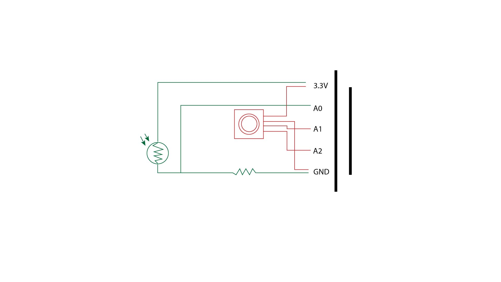
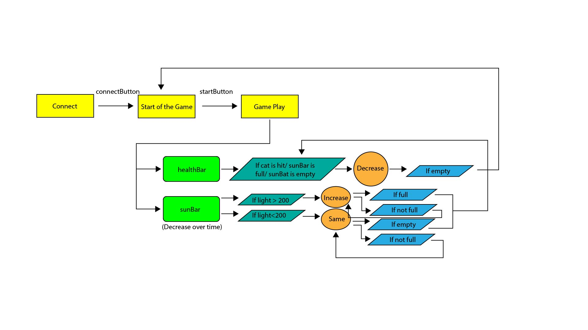
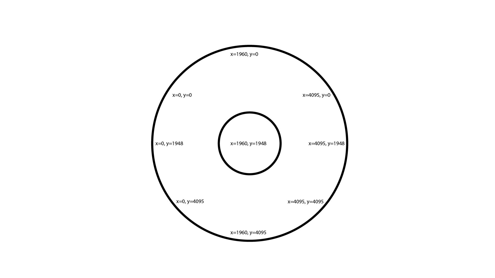
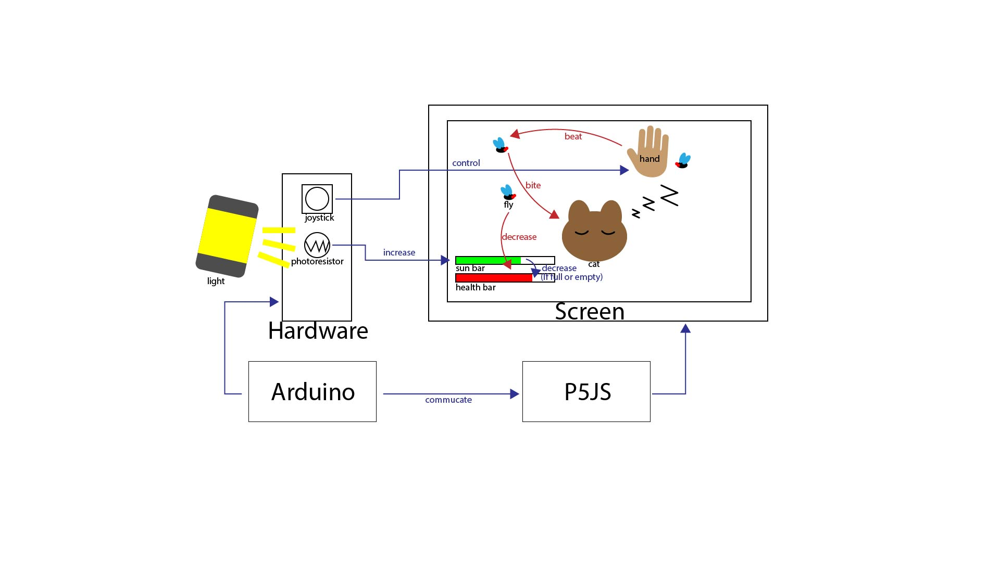

# FinalProject

This code is part of the code of the final project which is a game.

The overall logic of this game is that players start the game by pressing the start button. Once the game begins, a sleeping cat and a fly that wants to bite the cat appear on the screen (the fly is randomly generated and moves towards the cat). If the fly bites the cat, the cat's health bar will decrease. Players need to use a physical joystick to control a hand on the screen to swat the flies and also to keep the cat "warm." Once the game starts, the green sun bar will continuously decrease, and players need to periodically use a photoresistor to restore the sun bar. However, players must be careful in controlling it, because if the sun bar runs out or gets full, the cat's health bar will decrease. If the cat's health bar drops to zero, the game ends and resets.

The data read from p5.js to Arduino includes the joystick's x and y values and the value of the photoresistor. 
This project involves the use of a bidirectional joystick and a photoresistor. I have already purchased and started using them.

The user testing method is quite simple. After completing the basic functionality of the project next week, I will invite people to play the game and provide feedback for improvements.

Overall, this game and the previous reading are related to "The Art of Interactive Design". I am trying to use the game as a way to let users experience and understand the concept I want to convey. Through this game, I hope to let players experience the care of a master towards their pets, awakening people's disdain for pet abandonment.

Image on repo:  

