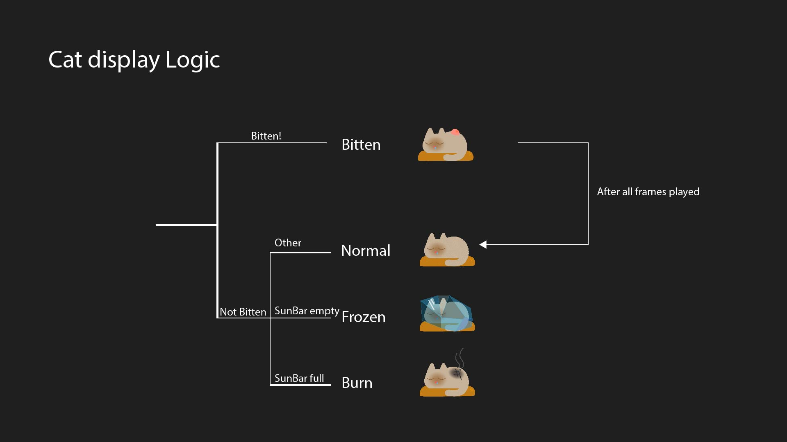
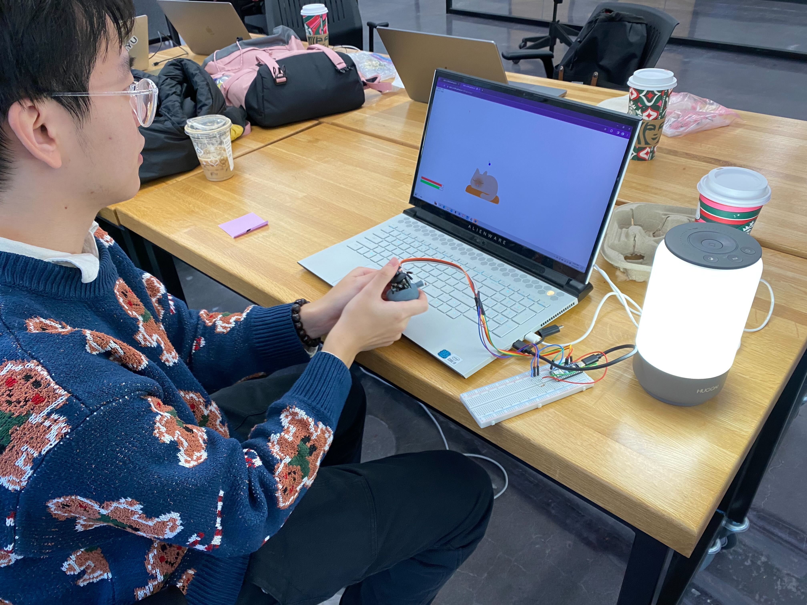

# FinalProject

# Milestone2
This code is part of the code of the final project which is a game.

The overall logic of this game is that players start the game by pressing the start button. Once the game begins, a sleeping cat and a fly that wants to bite the cat appear on the screen (the fly is randomly generated and moves towards the cat). If the fly bites the cat, the cat's health bar will decrease. Players need to use a physical joystick to control a hand on the screen to swat the flies and also to keep the cat "warm." Once the game starts, the green sun bar will continuously decrease, and players need to periodically use a photoresistor to restore the sun bar. However, players must be careful in controlling it, because if the sun bar runs out or gets full, the cat's health bar will decrease. If the cat's health bar drops to zero, the game ends and resets.

The data read from p5.js to Arduino includes the joystick's x and y values and the value of the photoresistor. 
This project involves the use of a bidirectional joystick and a photoresistor. I have already purchased and started using them.

The user testing method is quite simple. After completing the basic functionality of the project next week, I will invite people to play the game and provide feedback for improvements.

Overall, this game and the previous reading are related to "The Art of Interactive Design". I am trying to use the game as a way to let users experience and understand the concept I want to convey. Through this game, I hope to let players experience the care of a master towards their pets, awakening people's disdain for pet abandonment.
 

# Milestone3
This week, I completed the main framework and functionalities of the game. The content I developed includes: finalizing the logic for the "mosquito" enemies, which randomly appear from above and attack the cat through a curved flight path, reducing the cat's health. Players can control a blue ball to crush the mosquitoes and protect the cat. Meanwhile, I figured out how to mix PNG and GIF formats to display our main character, the cat. Now, depending on the game interaction, it has four states: normal, burnt, frozen, and bitten. I also upgraded the joystick control system, eliminating the issue of different speeds in different directions (diagonal being faster than horizontal or vertical). Now, as long as it's outside the dead zone, the ball will move uniformly in the direction of the joystick.

The main body of my game is essentially complete. The next step is to further enhance the game's UI. For instance, adding custom buttons, replacing the red balls representing mosquitoes and the blue balls representing the player with images or animations, and modifying the start and retry pages, etc. I might also need to adjust the game parameters to make the difficulty more appropriate.

The controller I 3D printed

The view of bread board

The logic of cat's display

Final circuit, FSM and system diagram, same as the old ones since the game framework is confirmed last time already

# Milestone4
## Game Overview
The overall logic of this game is that players start the game by pressing the start button. Also they can press the change button to change the main character. Once the game begins, a sleeping cat and mosquitos that wants to bite the cat appear on the screen (the mosquitos are randomly generated and moves towards the cat). The number of mosquitos on the screen would increase from 1 to 3 acorrding to time. If the mosquito bites the cat, the cat's health bar will decrease. Players need to use a physical joystick to control a anti-mosquito posion bottle on the screen to swat the mosquitos and also adjust the distance of the controller and the light source to keep the cat "warm." Once the game starts, the green sun bar will continuously decrease, and players need to periodically use the photoresistor to approach the light source to restore the sun bar. However, players must be careful in controlling it, because if the sun bar runs out or gets full, the cat's health bar will decrease. If the cat's health bar drops to zero, the game ends and resets. On the restart page, player would also be able to change the character again and see the time they survived in each round of game.
## System diagram

## FSM diagram

## Circuit diagram

## Description of any external data or library that you are planning to use
For this project, I am not using any external resources
## Description of any sensor, output component or mechanism that you are planning on using or building
Sensor: The data read from p5.js to Arduino includes the joystick's x and y values and the value of the photoresistor. 
This project involves the use of a bidirectional joystick and a photoresistor.
The controller I 3D printed

The view of bread board

## Reference images, texts and projects
Arduino joystick tutorial
https://arduinogetstarted.com/tutorials/arduino-joystick
## Short discussion of why your project is relevant
Overall, this game and the previous reading are related to "The Art of Interactive Design". I am trying to use the game as a way to let users experience and understand the concept I want to convey. Through this game, I hope to let players experience the care of a master towards their pets, awakening people's disdain for pet abandonment. It is important to me because from the beginning of this class, I always wanted to develope a high fidelity interactive experience in this course, and now I was able to complete it in this project, so it is really important to me.
## Short discussion of feedback from user testing
This is a game, and testing is very necessary. I invited some gamers to conduct several rounds of testing. I hope to adjust various parameters of the game to an appropriate value through the tests. The result of the test is that players of different levels have very different views on the difficulty. When there is one mosquito in the game, most players find it easy, but when there are two mosquitoes, some find it easy and others find it difficult. However, when the number of mosquitoes increases to three, almost all players find it difficult. To solve this problem, I adjusted the number of mosquitoes to increase over time (gradually from one to three), ensuring that players of different levels can enjoy the game. This also ensures that everyone's single discussion time in the classroom presentation is limited to one minute.
User testing

